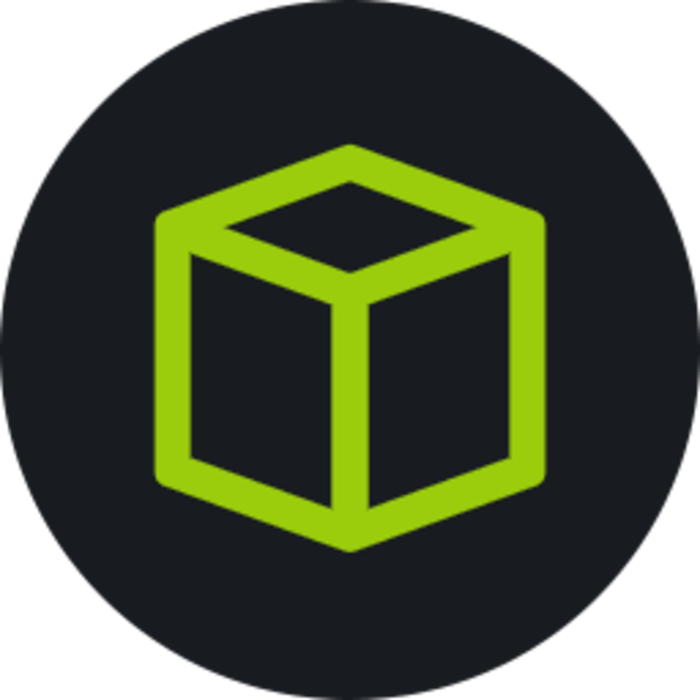

 <!---->

<!---->
<!---->

<h3> 👨🏻•💻 About Me </h3>

- 🎯 I'm passionate about **Cyber-security** and want to be a **Pen-tester**

- 🔭 I’m currently working on **Exploiting Kioptrix**

- 🌱 I’m currently learning **concepts and tools of cyber-security**

- 👨‍💻 All of my projects are available at - [https://github.com/Saswata28](https://github.com/Saswata28)

- 💻 My personal Portfolio - [https://saswata28.github.io/saswata-malakar.github.io/](https://saswata28.github.io/saswata-malakar.github.io/)

- 💬 Ask me anything about **Networking, Linux, or anything about cyber-security**

- 📫 How to reach me **saswatamalakar28@gmail.com**

<h3 align="left">Skills:</h3>

  
  
  
  
  
  
  
  
  
  
  
  
  
  

 

 

  

<h3 align="left">Connect with me:</h3>

  

### 📊 My Github Contributions

   

